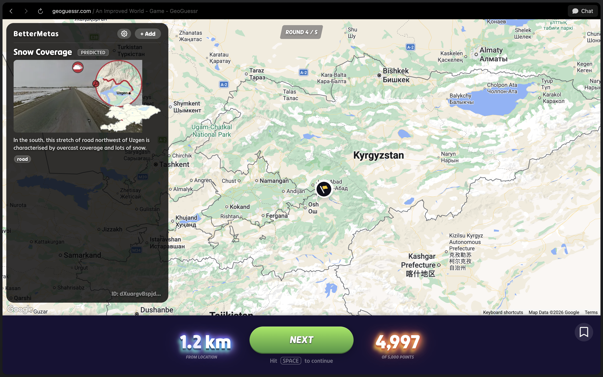
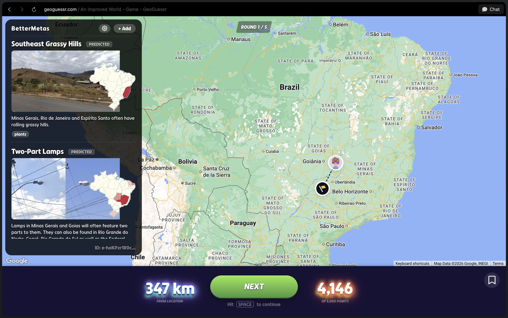
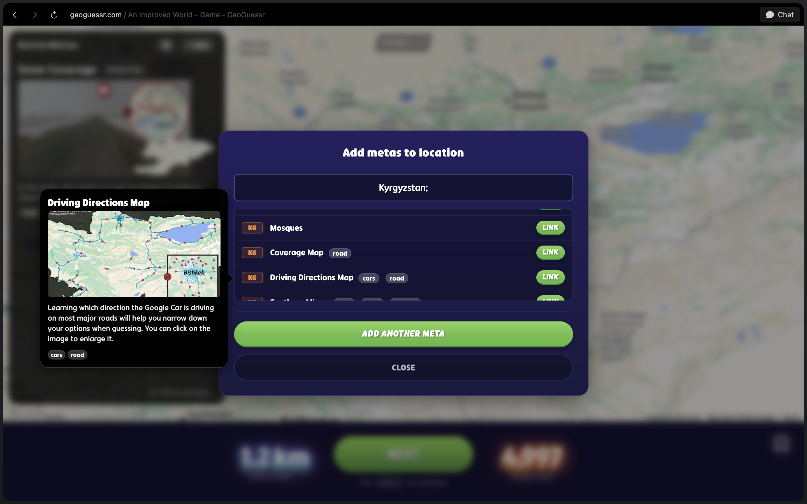
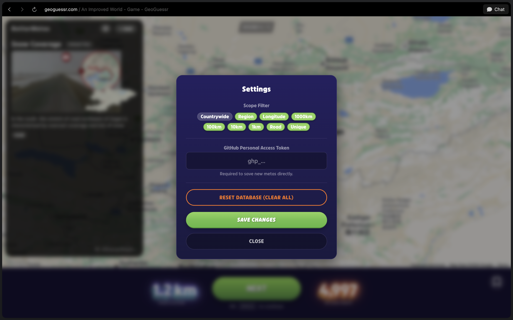

# BetterMetas - Geoguessr Companion

BetterMetas is a powerful Userscript for Geoguessr that helps you recognize and learn metas and hints directly in the game. It combines a huge database (based on Plonk It) with smart location predictions to eliminate the need of classyfying every single location.

## Features

- **Live HUD**: Automatically displays relevant hints, tags, and images for your current location.
- **Smart Predictions**: The script analyzes your location (country, region, city, road) and suggests metas that might apply here – not just exact matches, but also based on geography and "scopes" (e.g., 10km radius, regional, countrywide).
- **Plonk It Integration**: Includes thousands of entries from the detailed Plonk It guides.
- **Location Info**: Shows you precise address data, coordinates, and region names (powered by Google & Nominatim).
- **Crowdsourcing**: Add your own metas or link existing metas to new locations to improve the database.
- **Filters**: Customize which types of hints you want to see (e.g., only "Unique" or also "Countrywide").

## Installation

Since this is a specific Userscript, you need a Userscript manager for your browser.

1. Install the **Tampermonkey** browser extension (available for Chrome, Firefox, Edge, Safari).
2. **[Click here to install the script](https://raw.githubusercontent.com/lukas-hzb/better_metas/main_v2/geoguessr-meta.user.js)**.
3. Tampermonkey will ask if you want to add the script. Confirm by clicking "Install".
4. Open Geoguessr and start a game – the HUD should appear automatically.

## Screenshots

| Main HUD Preview | Predicted Metas |
| :---: | :---: |
|  |  |

| Add Meta Dialog | Settings Menu |
| :---: | :---: |
|  |  |

## Credits & Acknowledgements

A big thank you to the open-source community and data sources that make this project possible:

- **[Plonk It](https://www.plonkit.net)**: For the incredibly detailed Geoguessr guides that serve as the basis for much of the data.
- **[Nominatim / OpenStreetMap](https://nominatim.org/)**: For providing high-precision geodata and reverse geocoding.
- **Google Maps Platform**: For additional location data.

## License

This project is licensed under the **CC BY-NC 4.0 (Attribution-NonCommercial 4.0 International)**.

You are free to **use, change, and distribute** this software as long as you:
1.  **Give Credit**: You must explicitly name the author.
2.  **Non-Commercial**: You may **NOT** use this project for commercial purposes or financial gain without explicit permission.

For full legal details, see the [LICENSE](LICENSE) file.
